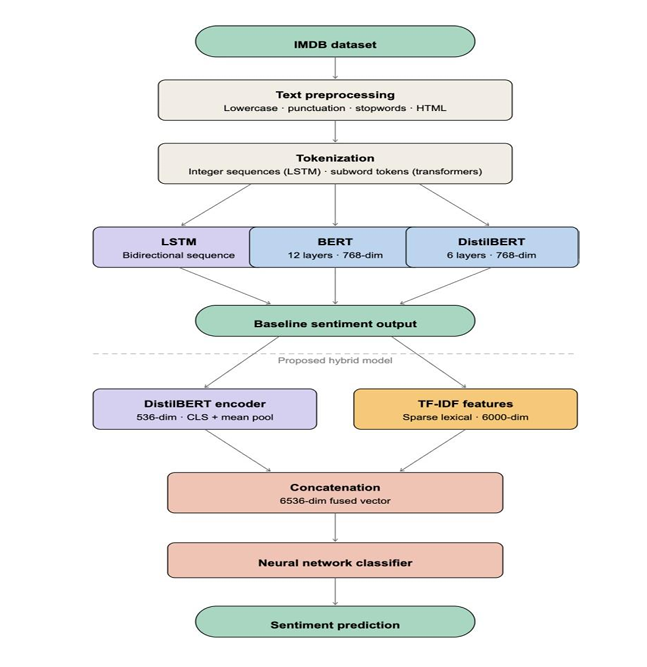
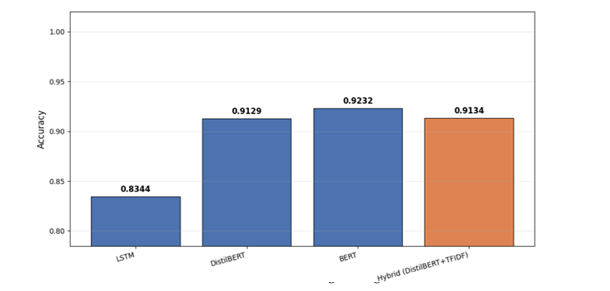
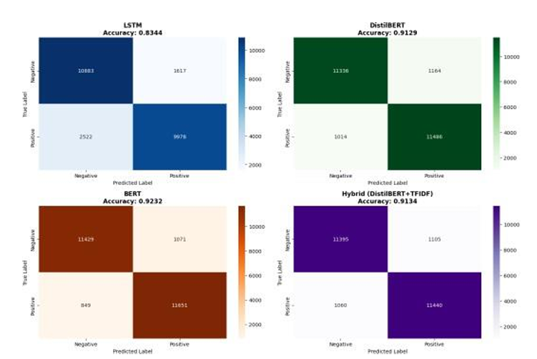
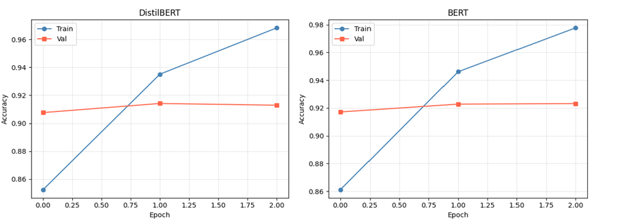

# 🎬 NLP Movie Review Sentiment Classification

An Intelligent NLP-Driven Framework comparing four architectures for
binary sentiment classification on the IMDB 50K review dataset,
including a novel Hybrid DistilBERT + TF-IDF model that approaches
BERT-level accuracy at a fraction of the computational cost.

🔗 **[Try the live demo](https://huggingface.co/spaces/SB-04/movie-sentiment-analyzer)**
*(free-tier Space — may take 30-60s to wake up on first load)*

## Publication
**An Intelligent NLP – Driven Framework for Movie Review Classification**
Shreeya B, Bindu Shree R, Kala Manjunatha, Madhura M, Dr. Mamatha V, Dr. H K Madhu
Department of CSE (Data Science), Bangalore Institute of Technology

Presented at ICRET 2026. Manuscript accepted for publication in the
*Journal of Current Research in Engineering and Science* (JCRES),
ISSN 2581-611X — forthcoming.

## Problem
Manually analyzing thousands of movie reviews for sentiment doesn't
scale. This project builds and rigorously benchmarks an automated
sentiment classification system, evaluating the accuracy-vs-cost
trade-off across four model families — from a classical recurrent
baseline to a novel hybrid transformer approach.

## Architecture

Preprocessed IMDB reviews are tokenized differently per model family
(integer sequences for LSTM, subword tokens for transformers). The
proposed Hybrid model branches off the baseline pipeline: fine-tuned
DistilBERT embeddings and TF-IDF lexical features are extracted in
parallel, concatenated into a single fused vector, and passed through
a dedicated neural network classifier.

## Results
| Model | Accuracy | Precision | Recall | F1 |
|---|---|---|---|---|
| BERT (fine-tuned) | 92.32% | 0.9233 | 0.9232 | 0.9232 |
| **Hybrid DistilBERT + TF-IDF (proposed)** | **91.34%** | 0.9134 | 0.9134 | 0.9134 |
| DistilBERT (fine-tuned) | 91.29% | 0.9129 | 0.9129 | 0.9129 |
| LSTM (baseline) | 83.44% | 0.8575 | 0.8344 | 0.8340 |

The confusion matrices show all three transformer-based models (BERT,
DistilBERT, and the Hybrid) are far more balanced across false
positives and false negatives than LSTM, which shows a visibly higher
false-negative count (2,522) — consistent with LSTM's weaker handling
of negation and sarcasm discussed below.

Both transformer models show train accuracy climbing well past
validation accuracy by epoch 2, while validation stays flat — the
gap signals the point past which further fine-tuning mainly overfits
rather than improves generalization, which is why both were capped
at 3 epochs.

## The Hybrid Model (core contribution)
Concatenates fine-tuned DistilBERT embeddings (CLS token + mean
pooling across all token hidden states, 1536-dim) with TF-IDF bigram
features (5,000-dim, sublinear scaling) into a 6,536-dim
representation, fed into a neural network classifier (two hidden
layers, 512 and 128 units, BatchNorm, Dropout 0.3, 10 epochs).

**Why it works:** DistilBERT's contextual embeddings understand
negation and sarcasm, while TF-IDF captures domain-specific lexical
signals (e.g. "cinematography," "screenplay") that correlate strongly
with sentiment but that transformers can underweight. The combination
outperforms either feature type alone — landing within 1% of full
BERT's accuracy while fine-tuning only the lighter DistilBERT model
underneath it.

## Qualitative Example
For the review *"Terrible film. Complete waste of time. The plot made
no sense,"* LSTM predicted **Positive** with 67% confidence — a clear
failure caused by its sequential architecture underweighting
sentiment-critical words. All three transformer-based models
correctly predicted **Negative** with high confidence, since
self-attention lets them weigh sentiment-bearing terms regardless of
position in the sentence.

## Dataset
IMDB Large Movie Review Dataset v1.0 — 50,000 reviews, perfectly
balanced (25K positive / 25K negative), 25K train / 25K test split,
loaded via HuggingFace `datasets`.

## Methodology
- **Preprocessing:** HTML/punctuation stripping, lowercasing, stopword
  removal; custom word-level tokenizer (10K vocab) for LSTM, HuggingFace
  WordPiece tokenizer (max 256 tokens) for transformers
- **LSTM:** 5 epochs, batch size 64, lr 1e-3, Adam
- **DistilBERT / BERT:** 3 epochs, batch size 16, lr 2e-5, AdamW,
  weight decay 0.01, linear warmup (10%), gradient clipping at 1.0
- **Hybrid classifier:** Adam (lr 1e-3, weight decay 1e-4), StepLR,
  10 epochs, batch size 256, StandardScaler-normalized features
- All four models evaluated identically: accuracy, precision, recall,
  F1, and confusion matrices on the same held-out test set

## Repository Contents
- `NLP_Movie_Review_Classification.ipynb` — full pipeline: data
  loading, preprocessing, all four models, evaluation, visualizations
- `images/` — architecture diagram and results charts

## Tools
Python, PyTorch, HuggingFace Transformers & Datasets, scikit-learn,
matplotlib/seaborn, Gradio, Google Colab (GPU)

